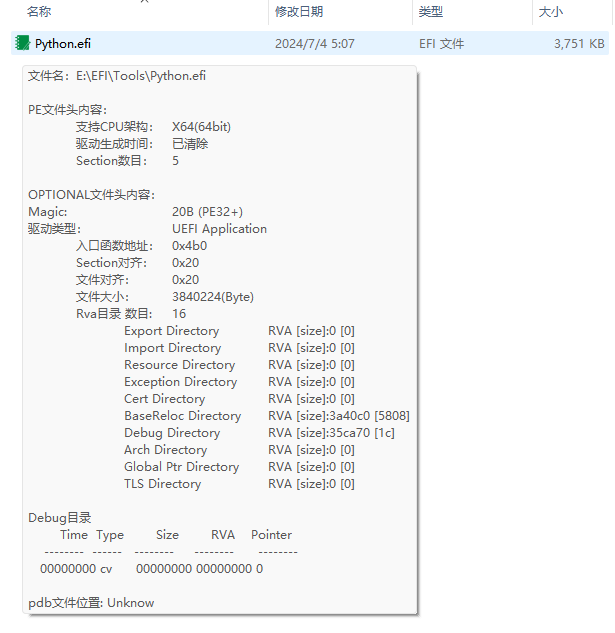

# RomHover
Display some detail info for .efi file.

### Info

Compiled on MS VS2022

Tested on Win11 && Win7

### Download
[Release Page](https://github.com/YangGangUEFI/RomHover/releases)

### Usage
* Open CMD with administrator privileges
* Register: regsvr32 RomHover.dll
* UnRegister: regsvr32 RomHover.dll

### Note:
1. The basic code refers to https://zhuanlan.zhihu.com/p/146747459
2. You may need to install [Microsoft Visual C++ Redistributable](https://learn.microsoft.com/en-us/cpp/windows/latest-supported-vc-redist?view=msvc-170)